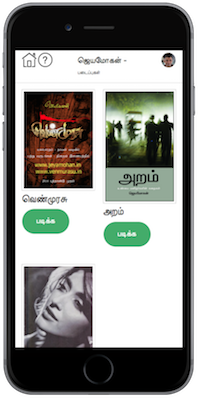

# Jeyamohan's Creations

Writer Jeyamohan's is a famour writer in Tamil Nadu, India. [Bio at Wikipedia](https://en.wikipedia.org/wiki/Jeyamohan)

When I started reading his book(s) on the Indian Epic Mahabharata named 'Venmurasu' (வெண்முரசு), I was drawn towards it more deeply due to its artistic description of the events.

But he was releasing one chapter each day and it was difficult for me to follow, I need to read the whole book in one stretch, that's how I am wired. So I stopped reading and waited till he completes each book. Then I would read them all.

While reading I found that the [Venmurasu Website](http://venmurasu.in) was based on wordpress blog and it was really not a good way to present a Novel, it just displays the chapter in reverse chronological order rather than the typical chapter flow of a book.

I started thinking about screen scraping the content and present in Responsive Web Design, so it would easier for me to read on my Phone, Tablet or Desktop wherever I am.

## App Development

Sep 2014 I had started doing screen scraping with Node.js app by

### Screen Scraping

* Navigating through the url
* Extract the content using XPath with cheeio package
* Extracted the chapter art image url, download and create create thumbnail and the full image after downloading
* Persist the data into the tables by Book, Volume, Chapters

### UI Design

As I wanted to read through various devices I wanted to use Responsive Web Design. Even though Twitter Bootstrap is very popular I went for Zurb Foundation as it just gives barebones and allows you to customize using the SASS variables. That also gives complete control over the design.

But during designing the app, I didn't customize the Zurb Foundation, just used it as it is by downloading the css/js files and put them under public and started designing the UI by hand coding the html and checking them on the browser.

Only later I started using all the productivity tools like Gulp, Twig, SASS customizing, Browser Sync and others.

### Infinte Scroll

I did the infinite scroll for two reasons, I can just hit the bottom of the each chapter to load the content of the next chapter few times which would cache the chapters on the browser so I can read them even if I am offline. And the other one to avoid number of clicks/taps the user needs to do to navigate and read, the chapters should load and ready for them to continue instead of they click/tap on the next link, wait for the page to load, that would distract the reading flow.

# Pre-requisite

## Data

Before running the application, the website needs to be scrapped and loaded to database.

Please load the data using the SQL available in the data folder.

`mysql -h <host> -u <user> -p <database> < data.sql`

## .env

Please create .env file under node-app folder with the following values to connect to MySQL instance where the data has been loaded.

```
DB_HOST=<host>
DB_USER=<user>
DB_PASS=<password>
DB_NAME=<db>
```

# How to Run the application

* `git clone git@github.com:ithiru/jemo.git`
* `cd jemo/Docker`
* `docker build -t jemo .`
* `cd ..`
* `docker run -it --rm -v $HOME/jemo/node-app:/app  --link mysql:mysql -p 8082:8082 jemo:1.0`

# Screenshots

## iPhone 5


## iPhone 6




## iPhone 6+


## iPad


## Android - Lenovo Vibe P1

## Mac Book Pro


## App Demo

[](http://www.youtube.com/watch?v=NJaVaP_fuM0)

## New UI


